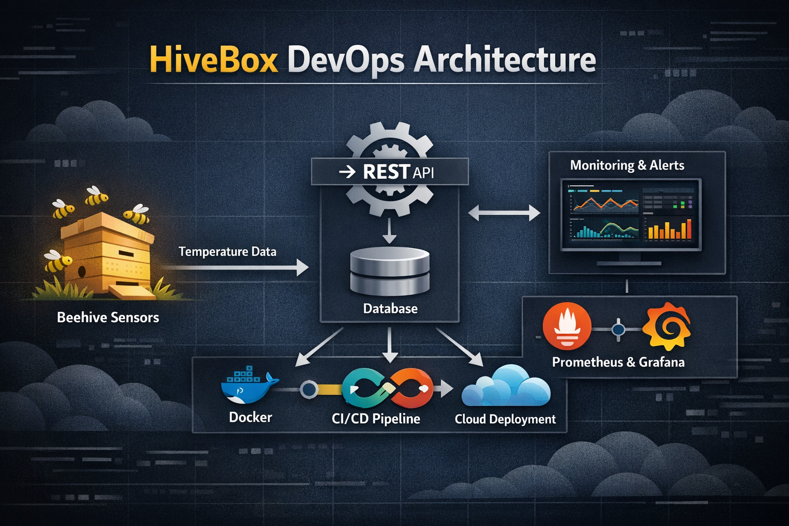

[](https://devopsroadmap.io/getting-started/)
[](https://newsletter.devopsroadmap.io/subscribe)
[](https://t.me/DevOpsHive/985)
[](https://github.com/DevOpsHiveHQ/devops-hands-on-project-hivebox/fork)

# 🐝 HiveBox - DevOps End-to-End Hands-On Project

<p align="center">
  
</p>

---

## 🚀 Project Overview

**HiveBox** is a production-oriented DevOps project designed to simulate real-world system engineering practices.

The system collects environmental temperature data from beehive sensors (via openSenseMap) and exposes it through a scalable RESTful API.

This project follows a **Dynamic DevOps Roadmap**, covering the full Software Development Life Cycle (SDLC):

* Planning
* Development
* Containerization
* CI/CD
* Monitoring
* Deployment

---

> ⚠️ **Important**
> Fork this repository and work on your own copy. Do NOT push directly to the original repo.

---

## 📋 Before You Start

* ⭐ Star the roadmap repository
* ✉️ Join the DevOps community
* 🌐 Join the Telegram group

---

## ⚙️ Preparation

* Create a GitHub account and fork the repository
* Create a GitHub Kanban project board
* Work using feature branches (never push to `main`)
* Document your progress continuously

---

### 🔗 openSenseMap Setup

Use these sample senseBox IDs:

| Station   | ID                         |
| --------- | -------------------------- |
| Station 1 | `5eba5fbad46fb8001b799786` |
| Station 2 | `5c21ff8f919bf8001adf2488` |
| Station 3 | `5ade1acf223bd80019a1011c` |

API endpoint:

```
https://api.opensensemap.org/boxes/{senseBoxId}
```

---

# 🧩 Implementation

---

## 🟢 Phase 1 — Working Environment Setup

**Status:** ✅ Complete
**Branch:** `phase-1`

### 📌 Project Management

* Methodology: Kanban
* Tool: GitHub Projects
* Columns: Backlog → Ready → In Progress → In Review → Done

---

### 📌 Repository Setup

* Forked from the official HiveBox repository
* Working in `phase-1` branch
* No direct commits to `main`

---

### 📌 Environment Setup

| Tool             | Purpose              |
| ---------------- | -------------------- |
| Kali Linux VM    | Development server   |
| VirtualBox       | Virtual machine host |
| Git + GitHub     | Version control      |
| PowerShell / SSH | Remote management    |

---

### 📌 File Structure

```
devops-hands-on-project-hivebox/
├── docs/
│   └── senseboxes.md
├── .env
├── .gitignore
└── README.md
```

---

## 🟡 Phase 2 — Containers and Initial Version

**Status:** ✅ Complete
**Branch:** `phase-2`

---

### 🐳 Tools Used

| Tool   | Version | Purpose             |
| ------ | ------- | ------------------- |
| Python | 3.11    | Application runtime |
| Docker | 29.2.1  | Containerization    |
| Git    | Latest  | Version control     |

---

### 🧠 Application Code

```python
APP_VERSION = "v0.0.1"

def print_version():
    print(f"HiveBox version: {APP_VERSION}")
```

---

### 🐳 Build Docker Image

```bash
docker build -t moughivebox:v0.0.1 .
```

---

### ▶️ Run Container

```bash
docker run moughivebox:v0.0.1
```

Expected output:

```
HiveBox version: v0.0.1
```

---

### 🔍 Verify Image

```bash
docker images | grep moughivebox
```

---

### 📂 File Structure

```
devops-hands-on-project-hivebox/
├── docs/
│   └── senseboxes.md
├── app.py
├── Dockerfile
├── .gitignore
└── README.md
```

---

## 👨‍💻 Author

**Mougahed A.B. Mohamed**
Engineer — MSAR ALHLWL Information Technology EST

🔗 GitHub: https://github.com/Moug-lab

---
